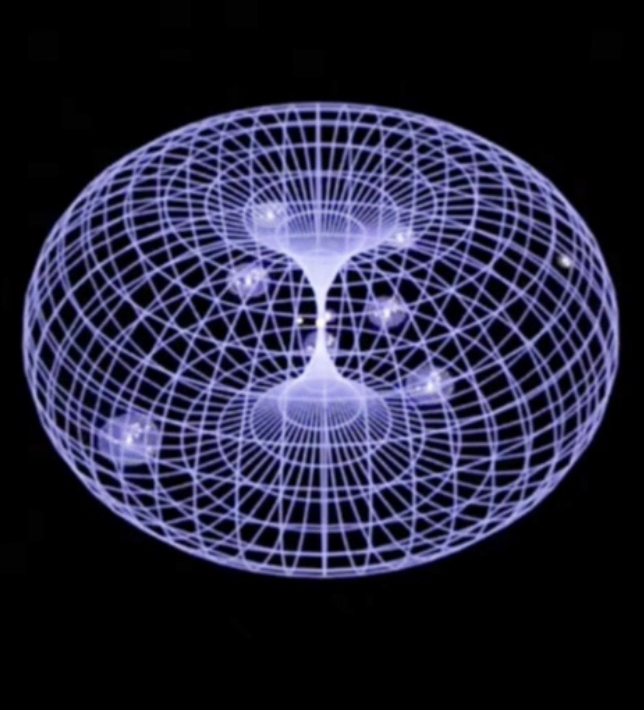

# MetaFor Framework

  

[English](README.md) | **Русский**

## 🧭 Управление сложностью в эпоху самоорганизующихся систем

Мы вступаем в новую эпоху, где код и процессы создаются не вручную, а через взаимодействие множества агентов — автономных систем, способных действовать, адаптироваться и развиваться.
Когда всё связано со всем, управление перестаёт быть линейным — нужно пространство, в котором человек может наблюдать, понимать и направлять происходящее.

**MetaFor** создаётся именно для этого. Это фреймворк, формирующий вычислительное пространство, где люди, агенты, устройства и приложения действуют совместно — как элементы одной системы.
В этом пространстве можно видеть процессы целиком, мгновенно переходить к деталям, управлять временем, ветвлениями и состояниями, а также координировать развитие систем — в привычных интерфейсах, VR и AR.

MetaFor — это шаг к вычислительной среде, где взаимодействие подчиняется тем же законам согласованности и самоорганизации, по которым устроена природа.

---

## _Фреймворк, формирующийся на принципах Теории квантового поля_

**MetaFor** — это развивающийся фреймворк нового поколения, создающий основу для объединения объектов, функционала, устройств и целых систем в **единое пространство взаимодействия**.  
Его цель — построить вычислительную среду, в которой принципы **взаимодействия, согласованности и самоорганизации** следуют тем же фундаментальным законам, по которым устроена природа.

> ⚠️ **Статус проекта**: MetaFor находится в активной фазе разработки. Документация может содержать неточности и может изменяться по мере развития фреймворка.  
> 🚨 **Использование в продакшене**: Использование в продакшене на свой страх и риск. Фреймворк еще не стабилен и может содержать критические изменения.

---

> 💡 В основе MetaFor лежит **фундаментальная идея переноса принципов Квантовой теории поля (Quantum Field Theory, QFT)** в программирование.  
> В процессе её осмысления была формализована **[Quantum Theory of Programming (qTp)](atom/README.ru.md)** — теоретический базис, определивший архитектурные и поведенческие принципы MetaFor.

---

## ⚛️ От физики к вычислительной архитектуре

Квантовая теория поля описывает Вселенную как непрерывное поле взаимодействий, где каждая частица — это **локальное возбуждение** внутри общего континуума.  
В такой модели нет жёстких границ: **всё связано со всем**, и порядок рождается из самой динамики взаимодействий.

MetaFor перенимает эти идеи, создавая **программное поле**, в котором каждый компонент — активный атом, связанный с другими через процессы, состояния и контексты.  
Так система становится не набором модулей, а **живой сетью взаимосвязей**, способной к самоорганизации и адаптации.

---

## 🧠 Теоретический фундамент — Quantum Theory of Programming

[**qTp**](atom/README.ru.md) — это не внешний инструмент, а естественная формализация принципов, которые легли в основу MetaFor.  
Она описывает, как программные атомы могут существовать, взаимодействовать и эволюционировать в общем вычислительном поле, сохраняя согласованность и устойчивость.

[qTp](atom/README.ru.md) определяет:

- как формируются связи и силы между элементами системы;
- как возникают эмерджентные структуры и динамика;
- как достигается устойчивое равновесие при изменениях.

MetaFor строится **на этих законах**, превращая теоретические принципы в инженерные механизмы.

---

## 🌍 Назначение MetaFor

MetaFor разрабатывается как универсальный фундамент для:

- объединения **гетерогенных** и **распределённых** систем в единую согласованную сеть,
- создания **самоорганизующихся вычислительных структур**,
- управления сложными взаимодействиями без централизации,
- построения **нового поколения приложений**, где адаптивность и устойчивость встроены на уровне архитектуры.

> 🎯 MetaFor — это шаг к созданию вычислительной среды, которая не просто исполняет код, а **живет по законам, аналогичным законам самой природы**.

---

## 📚 Документация

Для получения подробной информации о возможностях, API и примерах использования MetaFor, см. [полную документацию](meta/README.ru.md).

**Основные разделы документации:**

- [🚀 Основные возможности](meta/README.ru.md#-основные-возможности)
- [🎯 Быстрый старт](meta/README.ru.md#-быстрый-старт)
- [🏗️ Архитектура](meta/README.ru.md#️-архитектура)
- [🔧 API Reference](meta/README.ru.md#-api-reference)
- [🎨 Примеры](meta/README.ru.md#-примеры)
- [🔍 Отладка](meta/README.ru.md#-отладка)

---

## 🛠️ Инфраструктура

**Инструменты разработки и отладки для MetaFor:**

- [🧩 @metafor/inspect](infra/inspect/README.ru.md) — отладка атомов с пошаговым выполнением, снимками и воспроизведением

## 📅 Краткосрочные планы

- [x] [`@metafor/inspect`](infra/inspect/README.md) - вывод изменений и инициаторов изменений в консоль браузера
- [ ] [`@metafor/inspect`](infra/inspect/README.md) - остановка и замедление времени системы (debugger)
- [ ] `@metafor/virtual` - визуализация виртуальными частицами в процессе инициализации зависимостей графической системы
- [ ] `@metafor/mesh` - система 3D
- [ ] `@metafor/xr` - система VR/AR
- [ ] `ROADMAP`
