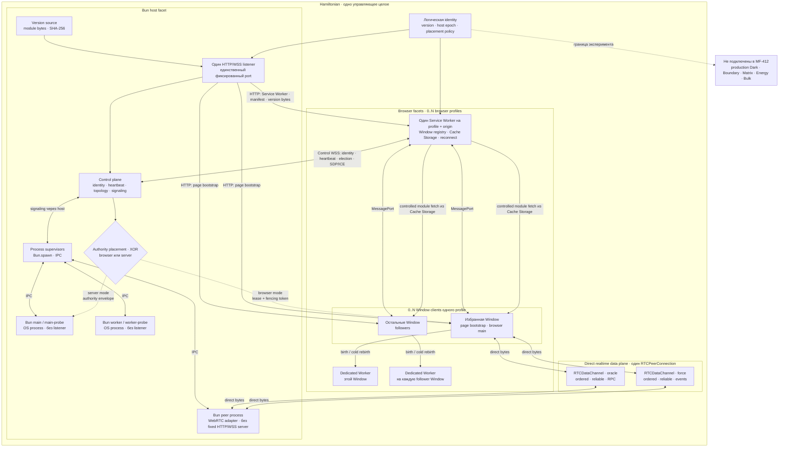

# Hamiltonian — статическая техническая карта

Основное представление теперь находится на интерактивной WebGPU-странице
Hamiltonian: она показывает фактический runtime и обновляется через отдельную
browser-local orchestration projection. Эта Mermaid-схема остаётся справочной
картой результата `MF-412`, а не целевой production-топологией MetaFor.

## Как читать схему

- `browser` и `server` — взаимоисключающие placement одного запуска. В
  `browser` authority получает ровно одна Window, а Bun-роли остаются probes;
  в `server` authority получает Bun `main`, а Window leader отсутствует.
- Control WSS заканчивается на единственном listener и не переносит realtime
  payload. Он нужен для identity, lease/election, version state и WebRTC
  signaling.
- После знакомства избранная Window и Bun peer обмениваются payload напрямую
  через два DataChannel внутри одного `RTCPeerConnection`; Service Worker и
  listener не являются realtime relay.
- Service Worker один только внутри конкретных `profile + origin`. Глобальную
  singleton-authority между разными браузерами и устройствами выдаёт Bun host.
- `oracle` и `force` здесь являются названиями испытательных логических lane.
  Production-домены и их протоколы в стенд не импортированы.
- Интерактивная сцена использует этот же listener для presentation-only
  `POST /node-system/route`: ELK предлагает первоначальные node positions,
  surviving nodes остаются фиксированными, а серверный Libavoid меняет только
  edge routes. Это не Oracle RPC, Force stream и не второй server/port.
