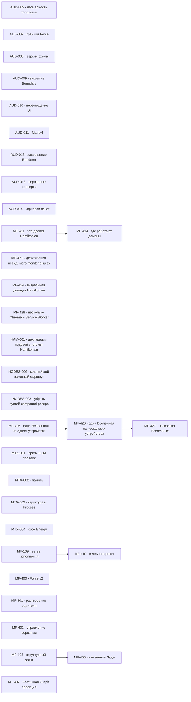

# MetaFor: граф исполнения

Здесь находятся только принятые задачи. Общие правила, состояния и жизненный
цикл заданы в [`README.md`](README.md), крупное направление — в
[`ROADMAP.md`](ROADMAP.md), а непринятая работа — в
[`BACKLOG.md`](BACKLOG.md).

Внутри одного приоритета порядок строк является порядком выбора. Стрелки на
графе показывают только настоящие зависимости, а не сходство тем.

## Граф зависимостей

## P1 — ближайшая работа

Текущая визуальная работа ведётся в `MF-424 — Визуально довести Hamiltonian
вместе с владельцем`. Подзадачи `MF-424.1` и `MF-424.3` приняты: серверная
часть остаётся в едином видимом контуре, а все одновременно открытые вкладки
находятся внутри одного Chrome и видят одинаковый retained lifecycle друг
друга. Текущий срез — `MF-424.2` про устойчивые цвета transport family и
легенду в панели `Вид холста`. Параллельно `MF-425 — Управлять одной Вселенной на
одном устройстве` уточняет границу устройства. Следом идут
`MF-426 — Распределить одну Вселенную между несколькими
устройствами` и `MF-427 — Управлять несколькими Вселенными`.
`MF-411 — Определить, что делает Hamiltonian и где он работает` остаётся
отдельной незавершённой работой. После неё начинается
`MF-414 — Определить, где работают домены и какая их копия действующая`.
Параллельно `NODES-006 — Выбирать кратчайший законный маршрут между равными
вариантами` проходит closing review изменений `@nodes/layout`. `NODES-008 —
Не оставлять пустой маршрутный резерв внутри compound` возвращена в работу:
checkpoint NODES-008.4 с общим исправлением левых интервалов сохранён отдельным
коммитом `b0fee1ee0`; owner review открыл NODES-008.5 для зеркального лишнего
интервала справа в `DOWN`. Реализация NODES-008.5 сохранена checkpoint-коммитом
`e1b2aea50` и ожидает визуального подтверждения владельца.

Отдельная пакетная задача `HAM-001 — Удерживать одну декларацию нодовой системы
каждого контура` формулирует общий Hamiltonian lifecycle contract. Срез
`HAM-001.1 — Заменять серверное поддерево при новой incarnation Hamiltonian`
принят. `HAM-001.2 — Показывать действующее WebRTC-соединение между браузером и
сервером` зафиксировал exact Oracle/Force declaration boundary, но live canvas
не показал уже принятые линии. Принятая диагностика `HAM-001.3 —
Установить, почему действующие WebRTC-линии не попадают в кадр` локализует
первую расходящуюся границу без product patch. `HAM-001.4 — Сохранять ноды,
которые продолжаются в новой декларации` исправила эту границу; applied layout и
canvas показали оба RTC endpoint и exact Oracle/Force lines. HAM-001.1–HAM-001.4 закрыты
после положительной независимой проверки; HAM-001 остаётся `IN_PROGRESS` для
остальных independently authoritative contours.

Текущая задача Codex: NODES-008.5 — не удваивать правый боковой corridor в
`DOWN`. HAM-001.1–HAM-001.4 закрыты; у HAM-001 нет текущего среза, а родитель намеренно
оставлен `IN_PROGRESS`.

| ID     | Состояние   | Зависимости | Карточка                   |
| ------ | ----------- | ----------- | -------------------------- |
| MF-424 | IN_PROGRESS | нет         | [Открыть](tasks/MF-424.md) |
| MF-425 | IN_PROGRESS | нет         | [Открыть](tasks/MF-425.md) |
| HAM-001 | IN_PROGRESS | нет         | [Открыть](tasks/HAM-001.md) |
| MF-411 | IN_PROGRESS | нет         | [Открыть](tasks/MF-411.md) |
| NODES-006 | REVIEW      | нет       | [Открыть](tasks/NODES-006.md) |
| NODES-008 | IN_PROGRESS | нет       | [Открыть](tasks/NODES-008.md) |
| MF-414 | WAITING     | MF-411      | [Открыть](tasks/MF-414.md) |
| MF-426 | WAITING     | MF-425      | [Открыть](tasks/MF-426.md) |
| MF-427 | WAITING     | MF-426      | [Открыть](tasks/MF-427.md) |

## P2 — функциональное продолжение и надёжность

`MF-428.5 — Нормализовать шапку ноды Service Worker` завершена отдельным
checkpoint-коммитом `70fe491c1`. MF-428 остаётся `IN_PROGRESS`; следующий
разрешённый срез `MF-428.4 — Обновлять Worker всех запущенных локальных
профилей` получил product checkpoint: manifest различает module и Worker
release, stale профили не допускаются в application topology/peer, а один
exact CDP-профиль live обновлён с Worker `1.0.0` до `1.1.0`. Live-derived
stale projection facts и transient error reason закрыты отдельными frozen
regressions; финальный offline proof — `195/195`, `4048` assertions. MF-428
остаётся `IN_PROGRESS`: для завершения среза нужна обязательная одновременная
exact-target проверка второго, default Chrome-профиля. CDP и Hamiltonian
оставлены запущенными; владелец должен открыть `http://127.0.0.1:4400` в
default Chrome process `408`. Web Push кода не переносит; иные среды и
выключенные профили в этот срез не входят.

| ID      | Состояние   | Зависимости | Карточка                    |
| ------- | ----------- | ----------- | --------------------------- |
| MF-407  | READY       | нет         | [Открыть](tasks/MF-407.md)  |
| MF-421  | READY       | нет         | [Открыть](tasks/MF-421.md)  |
| MF-428  | IN_PROGRESS | нет         | [Открыть](tasks/MF-428.md)  |
| AUD-009 | READY       | нет         | [Открыть](tasks/AUD-009.md) |
| AUD-005 | GATE        | нет         | [Открыть](tasks/AUD-005.md) |
| AUD-008 | GATE        | нет         | [Открыть](tasks/AUD-008.md) |
| AUD-013 | READY       | нет         | [Открыть](tasks/AUD-013.md) |
| AUD-010 | READY       | нет         | [Открыть](tasks/AUD-010.md) |
| AUD-011 | READY       | нет         | [Открыть](tasks/AUD-011.md) |
| AUD-012 | READY       | нет         | [Открыть](tasks/AUD-012.md) |
| MTX-001 | READY       | нет         | [Открыть](tasks/MTX-001.md) |
| AUD-007 | GATE        | нет         | [Открыть](tasks/AUD-007.md) |
| AUD-014 | GATE        | нет         | [Открыть](tasks/AUD-014.md) |

## P3 — поведение runtime

| ID      | Состояние | Зависимости | Карточка                    |
| ------- | --------- | ----------- | --------------------------- |
| MTX-002 | READY     | нет         | [Открыть](tasks/MTX-002.md) |
| MTX-003 | READY     | нет         | [Открыть](tasks/MTX-003.md) |

## P4 — отложенные решения

| ID      | Состояние | Зависимости | Карточка                    |
| ------- | --------- | ----------- | --------------------------- |
| MTX-004 | GATE      | нет         | [Открыть](tasks/MTX-004.md) |
| MF-400  | GATE      | нет         | [Открыть](tasks/MF-400.md)  |
| MF-401  | GATE      | нет         | [Открыть](tasks/MF-401.md)  |
| MF-402  | GATE      | нет         | [Открыть](tasks/MF-402.md)  |
| MF-109  | READY     | нет         | [Открыть](tasks/MF-109.md)  |
| MF-110  | WAITING   | MF-109      | [Открыть](tasks/MF-110.md)  |
| MF-405  | READY     | нет         | [Открыть](tasks/MF-405.md)  |
| MF-406  | WAITING   | MF-405      | [Открыть](tasks/MF-406.md)  |

## Требования к доказательству

Для завершения задачи нужны:

* изменённый закон и его постоянный владелец;
* точные публичные договоры;
* обычный пользовательский или предметный сценарий;
* выполненные команды проверки;
* фактический результат;
* известные ограничения;
* решение владельца, если задача проходила через `GATE`.
