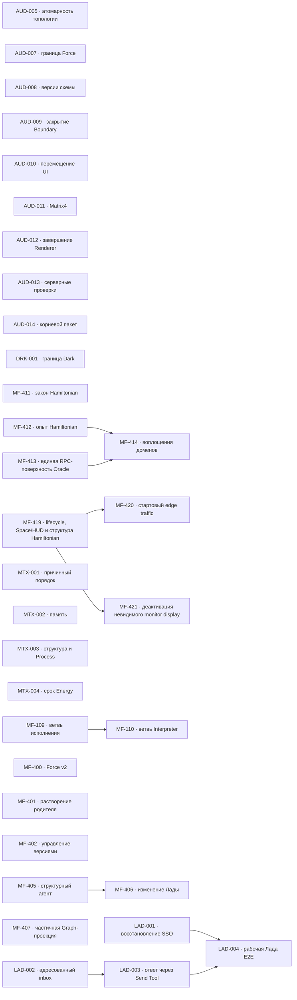
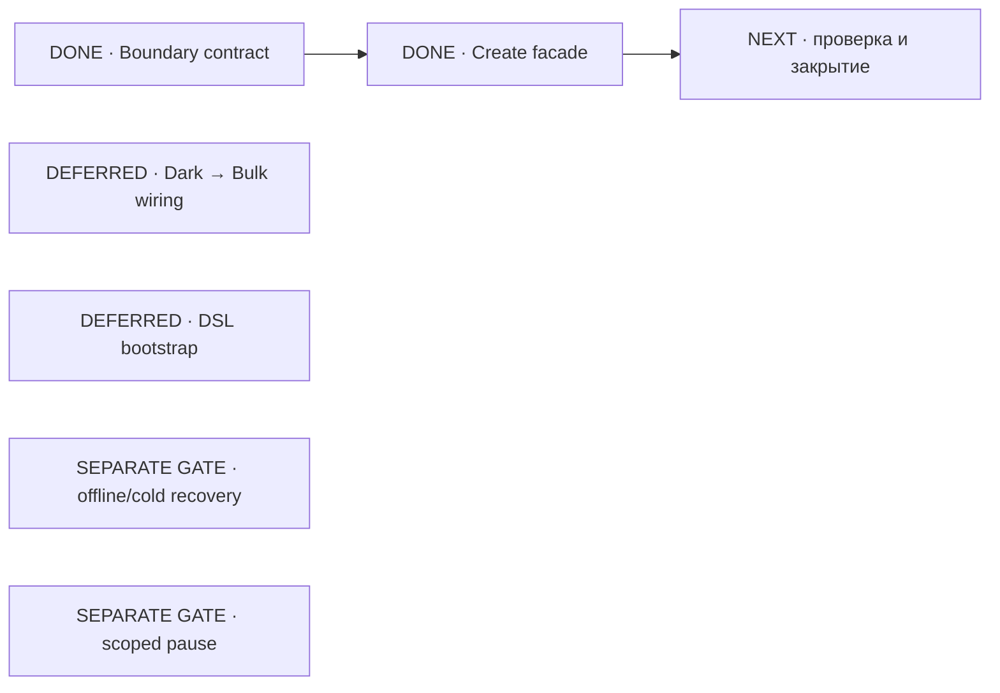

# MetaFor: граф исполнения

Здесь находятся только принятые задачи. Общие правила, состояния и жизненный
цикл заданы в [`README.md`](README.md), крупное направление — в
[`ROADMAP.md`](ROADMAP.md), а непринятая работа — в
[`BACKLOG.md`](BACKLOG.md).

Внутри одного приоритета порядок строк является порядком выбора. Стрелки на
графе показывают только настоящие зависимости, а не сходство тем.

## Граф зависимостей

## P0 — рабочий Production-контур Лады

Полная RPC-сессия одного доверенного агента и реальный адресованный ответ Лады
уже проверены. Задачи рабочего Production-контура находятся на отдельной
закрывающей проверке.

Текущая задача Codex: нет.

| ID      | Состояние   | Зависимости      | Карточка                    |
| ------- | ----------- | ---------------- | --------------------------- |
| LAD-001 | REVIEW      | нет              | [Открыть](tasks/LAD-001.md) |
| LAD-002 | REVIEW      | нет              | [Открыть](tasks/LAD-002.md) |
| LAD-003 | REVIEW      | LAD-002          | [Открыть](tasks/LAD-003.md) |
| LAD-004 | REVIEW      | LAD-001, LAD-003 | [Открыть](tasks/LAD-004.md) |

## P1 — ближайшая работа

Текущая задача Codex: нет. Причинно точный монитор Hamiltonian `MF-419`
и стартовая задержка edge traffic `MF-420` находятся на закрывающей проверке.
Документационный этап `MF-411` остаётся отдельной незавершённой работой.
`DRK-001` закрывает только два уже утверждённых public dependency slice.
`MF-411` продолжает уточнять закон Hamiltonian, а `MF-412` проверяет уже
принятую минимальную управляющую схему без production-кода MetaFor.

Эта диаграмма показывает этапы внутри одной карточки `DRK-001`, а не отдельные
задачи. Статусы и stop conditions подробно описаны в карточке.

Dark → Bulk wiring, DSL bootstrap и separate gates не входят в закрытие двух
утверждённых slices и не блокируют `NEXT`.

| ID      | Состояние   | Зависимости    | Карточка                    |
| ------- | ----------- | -------------- | --------------------------- |
| DRK-001 | REVIEW      | нет            | [Открыть](tasks/DRK-001.md) |
| MF-411  | IN_PROGRESS | нет            | [Открыть](tasks/MF-411.md)  |
| MF-412  | REVIEW      | нет            | [Открыть](tasks/MF-412.md)  |
| MF-413  | REVIEW      | нет            | [Открыть](tasks/MF-413.md)  |
| MF-414  | READY       | MF-412, MF-413 | [Открыть](tasks/MF-414.md)  |
| MF-419  | REVIEW      | нет            | [Открыть](tasks/MF-419.md)  |
| MF-420  | WAITING     | MF-419         | [Открыть](tasks/MF-420.md)  |

## P2 — функциональное продолжение и надёжность

| ID      | Состояние   | Зависимости | Карточка                    |
| ------- | ----------- | ----------- | --------------------------- |
| MF-407  | READY       | нет         | [Открыть](tasks/MF-407.md)  |
| MF-421  | WAITING     | MF-419      | [Открыть](tasks/MF-421.md)  |
| AUD-009 | READY       | нет         | [Открыть](tasks/AUD-009.md) |
| AUD-005 | GATE        | нет         | [Открыть](tasks/AUD-005.md) |
| AUD-008 | GATE        | нет         | [Открыть](tasks/AUD-008.md) |
| AUD-013 | READY       | нет         | [Открыть](tasks/AUD-013.md) |
| AUD-010 | READY       | нет         | [Открыть](tasks/AUD-010.md) |
| AUD-011 | READY       | нет         | [Открыть](tasks/AUD-011.md) |
| AUD-012 | READY       | нет         | [Открыть](tasks/AUD-012.md) |
| MTX-001 | READY       | нет         | [Открыть](tasks/MTX-001.md) |
| AUD-007 | GATE        | нет         | [Открыть](tasks/AUD-007.md) |
| AUD-014 | GATE        | нет         | [Открыть](tasks/AUD-014.md) |

## P3 — поведение runtime

| ID      | Состояние | Зависимости | Карточка                    |
| ------- | --------- | ----------- | --------------------------- |
| MTX-002 | READY     | нет         | [Открыть](tasks/MTX-002.md) |
| MTX-003 | READY     | нет         | [Открыть](tasks/MTX-003.md) |

## P4 — отложенные решения

| ID      | Состояние | Зависимости | Карточка                    |
| ------- | --------- | ----------- | --------------------------- |
| MTX-004 | GATE      | нет         | [Открыть](tasks/MTX-004.md) |
| MF-400  | GATE      | нет         | [Открыть](tasks/MF-400.md)  |
| MF-401  | GATE      | нет         | [Открыть](tasks/MF-401.md)  |
| MF-402  | GATE      | нет         | [Открыть](tasks/MF-402.md)  |
| MF-109  | READY     | нет         | [Открыть](tasks/MF-109.md)  |
| MF-110  | WAITING   | MF-109      | [Открыть](tasks/MF-110.md)  |
| MF-405  | READY     | нет         | [Открыть](tasks/MF-405.md)  |
| MF-406  | WAITING   | MF-405      | [Открыть](tasks/MF-406.md)  |

## Требования к доказательству

Для завершения задачи нужны:

* изменённый закон и его постоянный владелец;
* точные публичные договоры;
* обычный пользовательский или предметный сценарий;
* выполненные команды проверки;
* фактический результат;
* известные ограничения;
* решение владельца, если задача проходила через `GATE`.
