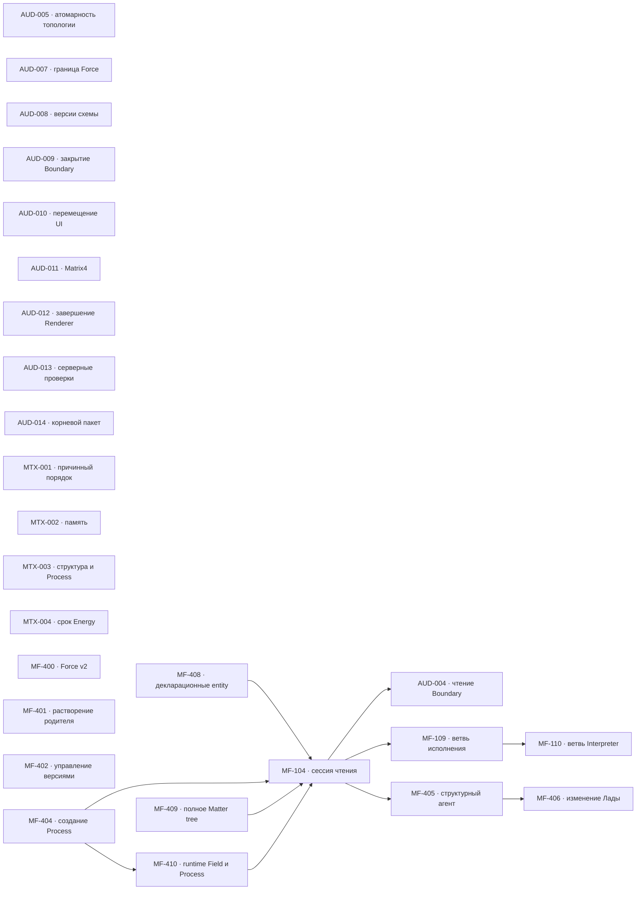

# MetaFor: граф исполнения

Здесь находятся только принятые задачи. Общие правила, состояния и жизненный
цикл заданы в [`README.md`](README.md), крупное направление — в
[`ROADMAP.md`](ROADMAP.md), а непринятая работа — в
[`BACKLOG.md`](BACKLOG.md).

Внутри одного приоритета порядок строк является порядком выбора. Стрелки на
графе показывают только настоящие зависимости, а не сходство тем.

## Граф зависимостей

## P0 — функциональная RPC-поверхность одного агента

| ID     | Состояние   | Зависимости                                                     | Карточка                   |
| ------ | ----------- | --------------------------------------------------------------- | -------------------------- |
| MF-408 | REVIEW      | нет                                                             | [Открыть](tasks/MF-408.md) |
| MF-404 | READY       | нет                                                             | [Открыть](tasks/MF-404.md) |
| MF-409 | READY       | нет                                                             | [Открыть](tasks/MF-409.md) |
| MF-410 | WAITING     | MF-404                                                          | [Открыть](tasks/MF-410.md) |
| MF-104 | WAITING     | MF-408, MF-404, MF-409, MF-410                                  | [Открыть](tasks/MF-104.md) |

Полная сессия `MF-104` не начинается, пока каждый отсутствующий метод из
зафиксированного inventory не реализован и не проверен.

Текущая задача Codex: нет, `MF-408` готова к закрывающей проверке.

## P1 — надёжность после функциональной полноты

| ID      | Состояние | Зависимости | Карточка                    |
| ------- | --------- | ----------- | --------------------------- |
| AUD-004 | WAITING   | MF-104      | [Открыть](tasks/AUD-004.md) |
| AUD-009 | READY     | нет         | [Открыть](tasks/AUD-009.md) |
| AUD-005 | GATE      | нет         | [Открыть](tasks/AUD-005.md) |
| AUD-008 | GATE      | нет         | [Открыть](tasks/AUD-008.md) |
| AUD-013 | READY     | нет         | [Открыть](tasks/AUD-013.md) |
| AUD-010 | READY     | нет         | [Открыть](tasks/AUD-010.md) |
| AUD-011 | READY     | нет         | [Открыть](tasks/AUD-011.md) |
| AUD-012 | READY     | нет         | [Открыть](tasks/AUD-012.md) |
| MTX-001 | READY     | нет         | [Открыть](tasks/MTX-001.md) |
| AUD-007 | GATE      | нет         | [Открыть](tasks/AUD-007.md) |
| AUD-014 | GATE      | нет         | [Открыть](tasks/AUD-014.md) |

## P2 — поведение runtime

| ID      | Состояние | Зависимости | Карточка                    |
| ------- | --------- | ----------- | --------------------------- |
| MTX-002 | READY     | нет         | [Открыть](tasks/MTX-002.md) |
| MTX-003 | READY     | нет         | [Открыть](tasks/MTX-003.md) |

## P4 — отложенные решения

| ID      | Состояние | Зависимости | Карточка                    |
| ------- | --------- | ----------- | --------------------------- |
| MTX-004 | GATE      | нет         | [Открыть](tasks/MTX-004.md) |
| MF-400  | GATE      | нет         | [Открыть](tasks/MF-400.md)  |
| MF-401  | GATE      | нет         | [Открыть](tasks/MF-401.md)  |
| MF-402  | GATE      | нет         | [Открыть](tasks/MF-402.md)  |
| MF-109  | WAITING   | MF-104      | [Открыть](tasks/MF-109.md)  |
| MF-110  | WAITING   | MF-109      | [Открыть](tasks/MF-110.md)  |
| MF-405  | WAITING   | MF-104      | [Открыть](tasks/MF-405.md)  |
| MF-406  | WAITING   | MF-405      | [Открыть](tasks/MF-406.md)  |

## Требования к доказательству

Для завершения задачи нужны:

* изменённый закон и его постоянный владелец;
* точные публичные договоры;
* обычный пользовательский или предметный сценарий;
* выполненные команды проверки;
* фактический результат;
* известные ограничения;
* решение владельца, если задача проходила через `GATE`.
