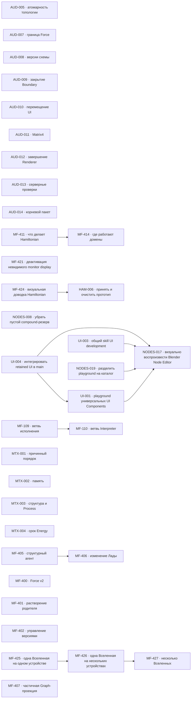

# MetaFor: граф исполнения

Здесь находятся только принятые задачи. Общие правила, состояния и жизненный
цикл заданы в [`README.md`](README.md), крупное направление — в
[`ROADMAP.md`](ROADMAP.md), а непринятая работа — в
[`BACKLOG.md`](BACKLOG.md).

Внутри одного приоритета порядок строк является порядком выбора. Стрелки на
графе показывают только настоящие зависимости, а не сходство тем.

## Граф зависимостей

## P1 — ближайшая работа

Текущая визуальная работа ведётся в `MF-424 — Визуально довести Hamiltonian
вместе с владельцем`. Подзадачи `MF-424.1` и `MF-424.3` приняты: серверная
часть остаётся в едином видимом контуре, а все одновременно открытые вкладки
находятся внутри одного Chrome и видят одинаковый retained lifecycle друг
друга. Текущий срез — `MF-424.2` про устойчивые цвета transport family и
легенду в панели `Вид холста`. Параллельно `MF-425 — Управлять одной Вселенной на
одном устройстве` уточняет границу устройства. Следом идут
`MF-426 — Распределить одну Вселенную между несколькими
устройствами` и `MF-427 — Управлять несколькими Вселенными`.
`MF-411 — Определить, что делает Hamiltonian и где он работает` остаётся
отдельной незавершённой работой. После неё начинается
`MF-414 — Определить, где работают домены и какая их копия действующая`.
`HAM-006 — Принять прототип Hamiltonian и очистить packages` ждёт завершения
живой visual acceptance `MF-424`; затем он завершит prototype line, удалит
prototype-only source/dependencies и примет clean-room contour.
`NODES-008 — Не оставлять пустой маршрутный резерв внутри compound` возвращена в работу:
checkpoint NODES-008.4 с общим исправлением левых интервалов сохранён отдельным
коммитом `b0fee1ee0`; owner review открыл NODES-008.5 для зеркального лишнего
интервала справа в `DOWN`. Реализация NODES-008.5 сохранена checkpoint-коммитом
`e1b2aea50` и ожидает визуального подтверждения владельца.

[`UI-004 — Интегрировать retained UI и общий UI skill в main`](tasks/UI-004.md)
ведёт owner-directed integration прямо в canonical `main`: сначала принимает
общий `UI dev` и проверяет все уже существующие package playgrounds, затем
интегрирует закрытый retained результат NODES-018, завершает миграцию
Elements/Components/consumers и возвращает NODES-017 к visual corrections без
подмены physical-device и owner-acceptance gates.

[`UI-003 — Создать общий skill разработки UI и Node playground`](tasks/UI-003.md)
находится в `REVIEW`: единый `ui-dev` перенесён в `pkg/ui`, registry-driven
lifecycle, background exact-CDP capture и structured profiling доказаны на
Node UI и Components. Integrated acceptance и закрытие выполняются в UI-004;
Node asset route остаётся следующим integration gate, а не compatibility alias.

[`UI-001 — Создать playground универсальных UI Components`](tasks/UI-001.md)
сохраняет восстановленный historical Components shell и universal Field route.
Localization/mobile proof и перевод на общий shell ждут интеграции принятого
retained результата в UI-004.

[`NODES-019 — Разделить playground Node System на каталог компонентов`](tasks/NODES-019.md)
продолжает только dev playground на public `@ui/playground`: отдельные sections
для полного Node Editor, Socket и Blender comparison не меняют Blender-style
Node, Parameter и current Field до retained integration.

[`NODES-017 — Визуально воспроизвести Blender Node Editor`](tasks/NODES-017.md)
сохраняет принятые row order, texture header и полноширинные enums. Остальные
Socket/header/shadow/LOD/alignment corrections ждут UI-004, NODES-019, UI-001 и
закрытия UI-003; physical mobile и owner acceptance остаются отдельными gates.

| ID     | Состояние   | Зависимости | Карточка                   |
| ------ | ----------- | ----------- | -------------------------- |
| MF-424 | IN_PROGRESS | нет         | [Открыть](tasks/MF-424.md) |
| HAM-006 | WAITING    | MF-424      | [Открыть](tasks/HAM-006.md) |
| MF-425 | IN_PROGRESS | нет         | [Открыть](tasks/MF-425.md) |
| MF-411 | IN_PROGRESS | нет         | [Открыть](tasks/MF-411.md) |
| NODES-008 | IN_PROGRESS | нет       | [Открыть](tasks/NODES-008.md) |
| UI-004 | IN_PROGRESS | нет         | [Открыть](tasks/UI-004.md) |
| NODES-019 | IN_PROGRESS | нет       | [Открыть](tasks/NODES-019.md) |
| UI-001 | WAITING     | UI-004     | [Открыть](tasks/UI-001.md) |
| UI-003 | REVIEW      | нет        | [Открыть](tasks/UI-003.md) |
| NODES-017 | WAITING  | UI-004, NODES-019, UI-001, UI-003 | [Открыть](tasks/NODES-017.md) |
| MF-414 | WAITING     | MF-411      | [Открыть](tasks/MF-414.md) |
| MF-426 | WAITING     | MF-425      | [Открыть](tasks/MF-426.md) |
| MF-427 | WAITING     | MF-426      | [Открыть](tasks/MF-427.md) |

## P2 — функциональное продолжение и надёжность

| ID      | Состояние   | Зависимости | Карточка                    |
| ------- | ----------- | ----------- | --------------------------- |
| MF-407  | READY       | нет         | [Открыть](tasks/MF-407.md)  |
| MF-421  | READY       | нет         | [Открыть](tasks/MF-421.md)  |
| AUD-009 | READY       | нет         | [Открыть](tasks/AUD-009.md) |
| AUD-005 | GATE        | нет         | [Открыть](tasks/AUD-005.md) |
| AUD-008 | GATE        | нет         | [Открыть](tasks/AUD-008.md) |
| AUD-013 | READY       | нет         | [Открыть](tasks/AUD-013.md) |
| AUD-010 | READY       | нет         | [Открыть](tasks/AUD-010.md) |
| AUD-011 | READY       | нет         | [Открыть](tasks/AUD-011.md) |
| AUD-012 | READY       | нет         | [Открыть](tasks/AUD-012.md) |
| MTX-001 | READY       | нет         | [Открыть](tasks/MTX-001.md) |
| AUD-007 | GATE        | нет         | [Открыть](tasks/AUD-007.md) |
| AUD-014 | GATE        | нет         | [Открыть](tasks/AUD-014.md) |

## P3 — поведение runtime

| ID      | Состояние | Зависимости | Карточка                    |
| ------- | --------- | ----------- | --------------------------- |
| MTX-002 | READY     | нет         | [Открыть](tasks/MTX-002.md) |
| MTX-003 | READY     | нет         | [Открыть](tasks/MTX-003.md) |

## P4 — отложенные решения

| ID      | Состояние | Зависимости | Карточка                    |
| ------- | --------- | ----------- | --------------------------- |
| MTX-004 | GATE      | нет         | [Открыть](tasks/MTX-004.md) |
| MF-400  | GATE      | нет         | [Открыть](tasks/MF-400.md)  |
| MF-401  | GATE      | нет         | [Открыть](tasks/MF-401.md)  |
| MF-402  | GATE      | нет         | [Открыть](tasks/MF-402.md)  |
| MF-109  | READY     | нет         | [Открыть](tasks/MF-109.md)  |
| MF-110  | WAITING   | MF-109      | [Открыть](tasks/MF-110.md)  |
| MF-405  | READY     | нет         | [Открыть](tasks/MF-405.md)  |
| MF-406  | WAITING   | MF-405      | [Открыть](tasks/MF-406.md)  |

## Требования к доказательству

Для завершения задачи нужны:

* изменённый закон и его постоянный владелец;
* точные публичные договоры;
* обычный пользовательский или предметный сценарий;
* выполненные команды проверки;
* фактический результат;
* известные ограничения;
* решение владельца, если задача проходила через `GATE`.
