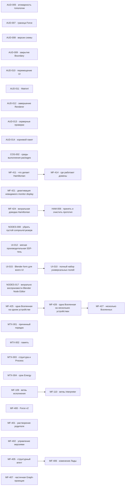

# MetaFor: граф исполнения

Здесь находятся только принятые задачи. Общие правила, состояния и жизненный
цикл заданы в [`README.md`](README.md), крупное направление — в
[`ROADMAP.md`](ROADMAP.md), а непринятая работа — в
[`BACKLOG.md`](BACKLOG.md).

Внутри одного приоритета порядок строк является порядком выбора. Стрелки на
графе показывают только настоящие зависимости, а не сходство тем.

## Граф зависимостей

## P1 — ближайшая работа

[`COS-002 — Однозначно описать среды выполнения пакетов`](tasks/COS-002.md)
фиксирует полную browser/Bun-классификацию `PackageEnvironment`, понятный смысл
каждого env и fail-closed выбор build target. Result `71a0c059b`, canonical
typecheck, Cosmos `80/80` и live exact artifacts готовы к independent review.

Текущая визуальная работа ведётся в `MF-424 — Визуально довести Hamiltonian
вместе с владельцем`. Подзадачи `MF-424.1` и `MF-424.3` приняты: серверная
часть остаётся в едином видимом контуре, а все одновременно открытые вкладки
находятся внутри одного Chrome и видят одинаковый retained lifecycle друг
друга. Текущий срез — `MF-424.2` про устойчивые цвета transport family и
легенду в панели `Вид холста`. Параллельно `MF-425 — Управлять одной Вселенной на
одном устройстве` уточняет границу устройства. Следом идут
`MF-426 — Распределить одну Вселенную между несколькими
устройствами` и `MF-427 — Управлять несколькими Вселенными`.
`MF-411 — Определить, что делает Hamiltonian и где он работает` остаётся
отдельной незавершённой работой. После неё начинается
`MF-414 — Определить, где работают домены и какая их копия действующая`.
`HAM-006 — Принять прототип Hamiltonian и очистить packages` ждёт завершения
живой visual acceptance `MF-424`; затем он завершит prototype line, удалит
prototype-only source/dependencies и примет clean-room contour.
`NODES-008 — Не оставлять пустой маршрутный резерв внутри compound` возвращена в работу:
checkpoint NODES-008.4 с общим исправлением левых интервалов сохранён отдельным
коммитом `b0fee1ee0`; owner review открыл NODES-008.5 для зеркального лишнего
интервала справа в `DOWN`. Реализация NODES-008.5 сохранена checkpoint-коммитом
`e1b2aea50` и ожидает визуального подтверждения владельца.

[`UI-010 — Сделать полный набор универсальных полей по Blender`](tasks/UI-010.md)
развивает production Components. NumberInput, ColorInput, VectorInput,
MatrixInput, ReferenceInput и EnumInput имеют package-owned stories и
package/live evidence. Текущий срез UI-010.7 добавляет public CollectionInput
для rows/selection/add/remove commit-ами `059deffc8` + `03b2c252b`; зависимая
UI-010.8 story/live `5df1327c5` завершила completeness `7/7`. Следующий public
leaf ещё не зарегистрирован. Текущий UI-010.9 добавляет owner-controlled
CollectionInput reorder commit-ом `2404e88ac`; зависимая UI-010.10 story/live
`7cae3d28c` завершена: encoded-PNG guard дал current non-black capture, exact
source/console и completeness `7/7`. Текущий UI-010.11 добавляет public
PathInput commit-ом `9aeb7f70c`; зависимая UI-010.12 story сейчас закрывает
completeness/live `8/8` source-ом `c998dd212` и current non-black capture. Новые
controls ждут UI-015 shape foundation, чтобы не продолжать старую pill form.

[`UI-015 — Перевести весь UI на форму и композицию Blender`](tasks/UI-015.md)
переводит Elements, Components, Fields и Workbench на Blender 4.5.5
composition/form/rhythm/palette; MetaFor сохраняет project font. Текущий срез измеряет exact
reference и уже ввёл Elements shape owner `af5ae43a8`; UI-015.2 подключает его
к Input/Button primitive chrome commit-ом `e6f7669bf` с before/after evidence.
UI-015.3/.4 завершили dense scalar rows и настоящий Elements dropdown commits
`813f48994`, `ea1af7aa5`, `9365d9af0`: единый radius `4`, тихий idle border и
повторный material-only Button press. UI-015.6 commit `cd85f9614` удалил exact
Workbench overrides `999/12/34/36`; live before/after и Node regression зелёные.
Owner RED `components-button-size-red.png` открыл UI-015.2.1: current Button
size меняет только font при fixed `22h`; новый size contract меняет всю visible
geometry/hit/layout после exact Blender tier research.
Новый owner screenshot `workbench-hierarchy-before.png` показал незакрытый
UI-015.6.1: expanded branch ошибочно равен selected toggle, rows остаются
centered rounded islands без disclosure slot/indent и keyboard tree law.
Владелец уточнил primary pattern новым
`workbench-accordion-reference.png`: Blender Properties/Preferences accordion
list, не Outliner tree; Outliner остаётся только keyboard corroboration.
Последующий side-by-side уточнил model boundary: accordion только grouped+
toggle catalog; ungrouped `Поле` остаётся отдельным selection list и не
наследует disclosure/left alignment. Current dark headers/gaps/bright outline
отклонены до source checkpoint.
Stable `c8f2cb854` сохраняет model direction, но material correction разделяет
outer #303030 region и #3d cards, убирает white focus. Workbench sections по
owner law не reorderable: grip отсутствует, fake dots запрещены.
Следующий UI-015.5 переводит Vector/Rotation/Matrix/Collection grouped editors.
Baseline на current Components Workbench подтвердил horizontal Vector,
раздельную Matrix и oversized Collection; UI-015.5 уже IN_PROGRESS.
Grouped source commit `14f440899` получил ownership PASS, но UI-015.5.1
исправляет active-cell inset, tooltip cursor и завышенные Matrix/Collection
reference claims до visual acceptance.
Owner Rotation RED открыл UI-015.5.2: unit должен принадлежать value (`0°`),
numeric column выравнивается справа с общим caret/selection origin, axis остаётся
X/Y/Z и использует number text role. Shared Vector RED добавляет default
precision3/right edge; Rotation precision0. Socket anchor доказан отдельной
label row, Node width/margins ждут exact proof.
Alignment commit `859973c95` прошёл stable restart: Vector `1.000/2.000/3.000`
right, Node Rotation `0°/45°/90°` below label-row Socket, console0. Color
material commit `39443a65b` получил marker/shadow proof, но static review открыл
exact value-strip correction: current hue tint → achromatic white→black.
Новый owner Transform RED открыл последовательную UI-015.5.3: connection-aware
plan уже скрывает linked Vector editor, но measurement продолжает резервировать
его полную высоту. Correction обязан свести measurement/layout к одному
visibility plan и снять скрытую editor height без fixture literals/gap hacks.
Тот же audit отдельно открыл UI-015.5.4 side-aware socket labels: input слева,
output справа, property label с двоеточием при неизменном Socket anchor; и
UI-015.5.5 source-backed default Node width вокруг intrinsic editor вместо
story literal `310`. Эти mechanisms выполняются последовательными slices.
UI-015.5.3 закрыта source/integration/static commits `9af766cec` + `914dabd7b`:
linked height `225→156`, later Link endpoint/hit re-anchor-ится к поднятому
Socket без изменения ортогональной topology, unlink восстанавливает editor;
source-fresh routes console0 и independent PASS. UI-015.5.4 теперь IN_PROGRESS;
live pointer corridor .5.3 остаётся parent interaction gate.
UI-015.5.4 закрыта source/static commits `16d5caa63` + `d770cf0fe`: input label
left с `:`, output right raw без `:`, mixed sides используют один Field;
source-fresh input/output/mixed routes console0 и independent PASS. UI-015.5.5
default content width теперь IN_PROGRESS; parent owner acceptance остаётся.
UI-015.5.5 закрыта source/static commits `ebee0da1b` + `b11cced6a`: Blender
default/min `140/100`, content inset `10`, Transform width `166` вокруг editor
`146`, explicit resize сохранён, linked/unlinked width одинаков; source-fresh
final routes console0 и independent PASS. Rejected `162` captures удалены.
UI-015.7 source checkpoint `13ac398d1` правильно разделил Engine low-level
picker plane и Components HSVA/popup owner, но independent Blender review
оставил composition/interaction незавершёнными. UI-015.7.1 после текущего
UI-015.8.2 source checkpoint соединяет Path/Reference в один ControlGroup,
разделяет compact и expanded ColorInput, исправляет exact checker material и
добавляет общий single-chain popup lifecycle с outside/Escape/viewport flip.
Source commit `7eb779e23` закрыл root lifecycle/basic composition, но review
открыл последовательные UI-015.7.2 cross-Surface nested chain, UI-015.7.3 joined
Button corners + group material roles и UI-015.7.4 Color marker/shadow material.
Owner Node screenshot дополнительно открыл UI-015.7.5: Popover lifecycle есть,
но retained popup content остаётся обычным sibling и перекрывается поздними
Parameter rows. Новый generic overlay portal должен атомарно вынести visual/
hits/dismiss owner в top Surface layer без Select/Node-specific z hack.
Grouped corners/roles закрыты source commit-ом `f1a6a75c1`; по owner priority
UI-015.7.5 overlay portal теперь IN_PROGRESS до Color marker/shadow UI-015.7.4.
Clean restart подтвердил второй root cause: explicit `fill:null` у
RoundedRectMaterial становится white alpha1. UI-015.7.6 исправляет Engine
transparent fill до overlay portal. Select gate также расширен exact Blender
header + separator contract; icon-column semantics принадлежат Components
EnumInput через generic Select content hooks, не Elements Select.
Engine fix `90d4b4569` + grouped fix `b88773252` прошли clean Vector restart:
X/Y/Z `1/2/3` видимы, white plane исчезла, console `0`; overlay portal снова
разблокирован.
Owner отменил сохранение MetaFor palette: UI-015.8 переводит base colors и
material states на Blender 4.5.5 по mapping от направленного Blender UI
помощника. UI-015.5/.7 source сохранён на pause до этого mapping.
Первый flat mapping получил `CORRECTION REQUIRED`: текущий gate — raw widget
classes + class-specific state resolvers без записи production theme values.
Вторая узкая amendment добавляет Boolean/Workbench classes, state precedence,
numeric zones и deep-freeze; production values всё ещё закрыты review gate.
Raw owner `eb3539420` получил independent PASS. UI-015.8.2 consumer contour
commit `c754dc40e` получил source/state-mapping PASS, но не interaction/visual
acceptance. UI-015.8.3 после popup correction добавляет отсутствующие Blender
step/scrub/text-transition gestures числовым полям; UI-015.9 ждёт и popup owner,
и numeric interaction, затем проверяет те же controls внутри expanded Node.
Numeric UI-015.8.3 идёт независимо correction chain на exact
`interface_handlers.cc` gesture law. Commit `21425023f` получил architecture/
delegation PASS, но исправляет threshold reset, frozen adaptive range и soft
side clamp; новый UI-015.8.4 следом добавляет Ctrl/Ctrl+Shift linear snapping.
Node gate ждёт оба направления.
UI-015.11 параллельно исправляет `$ui-dev`: no-HMR является осознанным delivery/
retained law, а stable source checkpoint требует exact selector restart и
explicit reload прежнего singleton target до browser evidence.
Skill commit `9691fd886` применён: stable `4ae3175be` загружен restart/reload на
Elements/Components/Node PIDs `19628/19627/19629`. Button sizes, Select header и
Node overlay дали console0/non-black captures.
Новый UI-015.8.5 регистрирует public `@ui/components/integer-input` и canonical
integer Field (`Iterations = 3`) поверх shared numeric gesture owner; FLOAT
остаётся NumberInput, compatibility `numberKind:"integer"` не удаляется.
Prerequisite UI-015.8.4 Ctrl/Ctrl+Shift linear drag snapping теперь IN_PROGRESS
на stable aligned numeric baseline.
Snap commit `b097460fe` завершён; UI-015.8.5 public IntegerInput теперь
завершён source/static commit-ом `d300a7719`: exact leaf/story/delivery/Field и
Node consumer готовы. Stable restart/reload PIDs `45117/45132/45133`, console0;
standalone и Node static PASS, hover/gesture/disabled owner gate остаётся.
Color correction `6ba99966c` также прошла source-fresh compact/expanded static
PASS с achromatic Value strip; same ColorInput in Node и pointer gate открыты.
Closing audit открыл UI-015.12: `$ui-dev` не имеет generic background mouse/
keyboard evidence, а direct CDP/macOS input запрещены. Новый skill slice
добавляет fail-closed data-only interaction plan на existing exact target,
после чего выполняет обязательную IntegerInput standalone+Node live matrix,
Color drag/marker и moved-Link pointer corridor.
Skill chain `99514eedc` + live corrections `9079df23d/b3234b8cd/ac0a65e1b`
теперь реально dispatch-ит background input: Integer left step `3→2`, route
preserved, console0. Hover checkpoints выявили новый production UI-015.8.6:
retained hover state меняется, но exact owner не rematerialize-ится, поэтому
arrows отсутствуют. UI-015.8.6 IN_PROGRESS до продолжения interaction matrix.
UI-015.8.6 commit `ecb2ddbe3` восстановил exact retained hover redraw; fresh
left/center/right показывают обе arrows и один active zone. Продолженная matrix
открыла UI-015.8.7: segmented Shift scrub теряет sub-integer delta, потому что
`rawCurrent` normalize-ится на каждом move. Новый accumulator slice IN_PROGRESS;
маскировать крупным artificial segment запрещено.
UI-015.8.7 commit `8af8989e7` хранит continuous raw accumulator; 2/12/60 event
paths invariant, source-fresh Shift `100px/12 moves` теперь `3→5`, console0.
Owner затем открыл UI-015.8.8: focus не снимается по outside/sibling click, и
active numeric control поэтому теряет scrub path. Новый общий Surface focus
owner проверяет все focusable Elements, Components и те же controls в Node;
Integer-only blur запрещён.
UI-015.8.8 commit `97acb6843` получил independent SOURCE PASS и standalone
Integer LIVE PASS: outside commit/blur, drag `3→6/0`, typed `12`,
disabled/readOnly, console0. Escape/right cancel и broad Text/grouped/popup
focus gates открыты. Node plan выявил UI-015.9.1: fixture Fields не имеют
callbacks и static tree не меняет value. Новый dev-only controlled Field owner
покрывает все mutable kinds без renderer-local state; commit `dfd3a1bc1`
публикует actual Node dataset `3→6/0`. Canvas всё ещё рисует `3`: underlying
Elements Input ошибочно считает NumberInput uncontrolled, потому что numeric
owner использует `onSubmit`, а controlled mode выводится только из `onChange`.
Новый UI-015.8.9 исправляет единый controlled numeric display contract для
standalone/grouped/Node commit-ом `ed8946645`: source-fresh canvases теперь
реально показывают `6/0`. Escape/right cancel возвращают `3`; Text outside,
grouped X→Y и Node Integer→Select child→Integer проходят с console0. Полные
Elements/Components suites покрывают остальные public consumers без stale
focus. Standalone Color wheel/value markers и moved Rotation Link corridor
также прошли exact pointer plans с console0; selected Link id =
`scalar-transform-rotation`. UI-015.9.2 теперь добавляет только deterministic
unlinked Color story variant, потому что обычный `transform-shader` link по
Blender law скрывает editor; renderer/ColorInput не меняются. Commit
`4f9f0da31` + Node PID `59195` закрывают этот gate: wheel/value markers и owner
RGBA меняются, Escape/outside закрывают popup, console0. UI-015.12 interaction
capability/result complete; parent visual inventory и preview-toggle/window
audit ещё не закрыты. Independent tail review подтвердил exact UI-015.9 gap:
fixture не содержит Path/Collection, а Reference требует activate/pick/clear
evidence. UI-015.9.3 commit `b066077f9` + source-fresh PID `65875` закрывают
inventory: Path edit/browse, Reference activate/pick/clear и Collection
select/add/move/remove публикуют exact values/actions, console0. Отдельный
UI-015.9.4 теперь WAITING только на material/state matrix и затем добавляет
настоящий Blender Node Preview: controlled eye toggle,
persistent node flag, global preview visibility и extra-info image panel над
body без изменения body/Socket/Link geometry.
Перед Preview текущий UI-015.8.10 закрывает подтверждённые material gaps:
raw Scrollbar вместо palette blue, one-pixel alignment-aware widget emboss,
editorBorder отдельно от outline и distinct panel header/body roles. Panel
radius `4` уже доказан формулой `.4×20×.5`; dormant `focused→activeDefault`
deferred до отдельной widget keyboard-focus capability и не заявляется PASS.
Source/result commit `818c08ed1` и no-HMR restart/reload evidence на PIDs
`72235/72464/72694` закрыли этот dependency; synthetic matrix и console0
зафиксированы в `material-state.result.json`, owner visual acceptance остаётся
UI-015.10.
UI-015.9.4 source commit `1e5660ae3` теперь добавляет controlled preview eye,
per-node flags, global hide/show и extra-info image panel над неизменным body.
Source-fresh PID `84993` закрывает toggle/buffer/multiple/non-previewable/body-hit
matrix с console0; `node-preview.result.json` хранит exact evidence. .9.4 в
REVIEW. Equal-scale UI-015.10 нашла новый точный numeric visual regression:
right-aligned value-only NumberInput внутри Vector перекрывает правую hover
arrow, хотя standalone labeled Integer и Elements draw regressions остаются
green. UI-015.8.11 commit `4ad33fcda` теперь резервирует обе generic numeric
handle zones; source-fresh Number/Integer/Vector/Node captures показывают обе
arrows без перекрытия value, console0. Active slice снова UI-015.10: пересобрать
equal-scale matrix и получить explicit owner visual verdict. Восемь current
pairs теперь готовы на source `4ad33fcda`; UI-015.10 переведена в GATE до
решения владельца по scalar/enum/vector/path/reference/collection/color/shell.
Owner live finding открыл UI-015.8.12: center click numeric input ошибочно ставит
caret перед right-aligned value, тогда как Blender начинает text edit с
end-caret и select-all. Commits `67d896ca6` + `827ce5896` закрыли source/live:
Number/Integer/Vector/Node выделяют whole value, caret справа, first key заменяет
значение, console0. Active slice снова UI-015.10 GATE для owner visual verdict.
Public Elements остаются HTML-аналогами, составные controls принадлежат
Components; UI-015.9 сразу подключает необходимые Components в Node UI до общей
visual matrix.

[`UI-012 — Добавить мягкую производительную SDF-тень`](tasks/UI-012.md)
создала package-level Engine/Elements primitive commit-ом `e5d484ddc`: один
rounded SDF quad со spread/blur в local units, без texture pass. Node consumer
`b9f9419fb` и exact ordinary/selected live evidence `8ef8ed959` завершены;
задача в `REVIEW` перед independent closing.

[`NODES-017 — Визуально воспроизвести Blender Node Editor`](tasks/NODES-017.md)
возвращена в работу на integrated retained foundation. Следующий срез —
LOD owner GATE: старый `<0.38` skip уже удалён retained foundation, поэтому
нужно выбрать новый progressive threshold mechanism либо принять непрерывное
intrinsic scaling. Socket, geometric header и четырёхсторонняя selection shadow
уже имеют package/live evidence. Alignment, exact collapsed Mapping, physical
mobile и явная visual owner acceptance остаются следующими gates.
Новый owner side-by-side открыл NODES-017.8.4.1: project-font title поднят
относительно optical center header/chevron и требует shared text-bounds
correction без fixture offset.

| ID     | Состояние   | Зависимости | Карточка                   |
| ------ | ----------- | ----------- | -------------------------- |
| COS-002 | REVIEW      | нет        | [Открыть](tasks/COS-002.md) |
| MF-424 | IN_PROGRESS | нет         | [Открыть](tasks/MF-424.md) |
| HAM-006 | WAITING    | MF-424      | [Открыть](tasks/HAM-006.md) |
| MF-425 | IN_PROGRESS | нет         | [Открыть](tasks/MF-425.md) |
| MF-411 | IN_PROGRESS | нет         | [Открыть](tasks/MF-411.md) |
| NODES-008 | IN_PROGRESS | нет       | [Открыть](tasks/NODES-008.md) |
| UI-015 | IN_PROGRESS | нет         | [Открыть](tasks/UI-015.md) |
| UI-010 | WAITING     | UI-015      | [Открыть](tasks/UI-010.md) |
| UI-012 | REVIEW      | нет         | [Открыть](tasks/UI-012.md) |
| NODES-017 | IN_PROGRESS | нет      | [Открыть](tasks/NODES-017.md) |
| MF-414 | WAITING     | MF-411      | [Открыть](tasks/MF-414.md) |
| MF-426 | WAITING     | MF-425      | [Открыть](tasks/MF-426.md) |
| MF-427 | WAITING     | MF-426      | [Открыть](tasks/MF-427.md) |

## P2 — функциональное продолжение и надёжность

| ID      | Состояние   | Зависимости | Карточка                    |
| ------- | ----------- | ----------- | --------------------------- |
| MF-407  | READY       | нет         | [Открыть](tasks/MF-407.md)  |
| MF-421  | READY       | нет         | [Открыть](tasks/MF-421.md)  |
| AUD-009 | READY       | нет         | [Открыть](tasks/AUD-009.md) |
| AUD-005 | GATE        | нет         | [Открыть](tasks/AUD-005.md) |
| AUD-008 | GATE        | нет         | [Открыть](tasks/AUD-008.md) |
| AUD-013 | READY       | нет         | [Открыть](tasks/AUD-013.md) |
| AUD-010 | READY       | нет         | [Открыть](tasks/AUD-010.md) |
| AUD-011 | READY       | нет         | [Открыть](tasks/AUD-011.md) |
| AUD-012 | READY       | нет         | [Открыть](tasks/AUD-012.md) |
| MTX-001 | READY       | нет         | [Открыть](tasks/MTX-001.md) |
| AUD-007 | GATE        | нет         | [Открыть](tasks/AUD-007.md) |
| AUD-014 | GATE        | нет         | [Открыть](tasks/AUD-014.md) |

## P3 — поведение runtime

| ID      | Состояние | Зависимости | Карточка                    |
| ------- | --------- | ----------- | --------------------------- |
| MTX-002 | READY     | нет         | [Открыть](tasks/MTX-002.md) |
| MTX-003 | READY     | нет         | [Открыть](tasks/MTX-003.md) |

## P4 — отложенные решения

| ID      | Состояние | Зависимости | Карточка                    |
| ------- | --------- | ----------- | --------------------------- |
| MTX-004 | GATE      | нет         | [Открыть](tasks/MTX-004.md) |
| MF-400  | GATE      | нет         | [Открыть](tasks/MF-400.md)  |
| MF-401  | GATE      | нет         | [Открыть](tasks/MF-401.md)  |
| MF-402  | GATE      | нет         | [Открыть](tasks/MF-402.md)  |
| MF-109  | READY     | нет         | [Открыть](tasks/MF-109.md)  |
| MF-110  | WAITING   | MF-109      | [Открыть](tasks/MF-110.md)  |
| MF-405  | READY     | нет         | [Открыть](tasks/MF-405.md)  |
| MF-406  | WAITING   | MF-405      | [Открыть](tasks/MF-406.md)  |

## Требования к доказательству

Для завершения задачи нужны:

* изменённый закон и его постоянный владелец;
* точные публичные договоры;
* обычный пользовательский или предметный сценарий;
* выполненные команды проверки;
* фактический результат;
* известные ограничения;
* решение владельца, если задача проходила через `GATE`.
