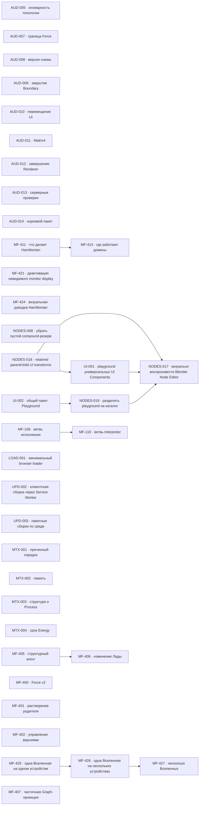

# MetaFor: граф исполнения

Здесь находятся только принятые задачи. Общие правила, состояния и жизненный
цикл заданы в [`README.md`](README.md), крупное направление — в
[`ROADMAP.md`](ROADMAP.md), а непринятая работа — в
[`BACKLOG.md`](BACKLOG.md).

Внутри одного приоритета порядок строк является порядком выбора. Стрелки на
графе показывают только настоящие зависимости, а не сходство тем.

## Граф зависимостей

## P1 — ближайшая работа

Текущая визуальная работа ведётся в `MF-424 — Визуально довести Hamiltonian
вместе с владельцем`. Подзадачи `MF-424.1` и `MF-424.3` приняты: серверная
часть остаётся в едином видимом контуре, а все одновременно открытые вкладки
находятся внутри одного Chrome и видят одинаковый retained lifecycle друг
друга. Текущий срез — `MF-424.2` про устойчивые цвета transport family и
легенду в панели `Вид холста`. Параллельно `MF-425 — Управлять одной Вселенной на
одном устройстве` уточняет границу устройства. Следом идут
`MF-426 — Распределить одну Вселенную между несколькими
устройствами` и `MF-427 — Управлять несколькими Вселенными`.
`MF-411 — Определить, что делает Hamiltonian и где он работает` остаётся
отдельной незавершённой работой. После неё начинается
`MF-414 — Определить, где работают домены и какая их копия действующая`.
`NODES-008 — Не оставлять пустой маршрутный резерв внутри compound` возвращена в работу:
checkpoint NODES-008.4 с общим исправлением левых интервалов сохранён отдельным
коммитом `b0fee1ee0`; owner review открыл NODES-008.5 для зеркального лишнего
интервала справа в `DOWN`. Реализация NODES-008.5 сохранена checkpoint-коммитом
`e1b2aea50` и ожидает визуального подтверждения владельца.

[`NODES-018 — Перевести UI на engine parent/child transforms`](tasks/NODES-018.md)
исправляет найденный в NODES-017 системный разрыв: Three.js-like engine уже
поддерживает inherited `matrixWorld`, но immediate-mode `UiSurface` и NodeCanvas
запекают transform каждого child на CPU и пересоздают плоские layers. Текущий
срез закрепляет retained engine/UI contract и baseline перед переносом NodeCanvas.

[`NODES-019 — Разделить playground Node System на каталог компонентов`](tasks/NODES-019.md)
параллельно меняет только dev playground: отдельные sections для полного Node
Editor, Socket и Blender comparison вместо одной перегруженной страницы. Socket
catalog не представляет input rows как Parameter.

[`UI-001 — Создать playground универсальных UI Components`](tasks/UI-001.md)
восстанавливает удалённый commit `0b3b0b2ca` готовый shadcn-style Components
playground: catalog, section, preview, dock и parameters panels. Уже в этот
interface добавляются current text/number/slider/Switcher/enum/color/vector/
rotation/matrix/reference/read-only Fields. Node playground больше не владеет
standalone input examples и только импортирует components в Node. Checkpoint
`d0f6f702d` восстановил historical shell и Field route на exact target 4017;
localization/mobile proof остаются текущим UI-001.3.

[`UI-002 — Создать общий пакет Playground для UI-каталогов`](tasks/UI-002.md)
выносит historical router и пятипанельный FlexBox shell в отдельный
`@ui/playground`. Elements/Components и Node implementation заморожены; первым
новым consumer после package proof станет NODES-019. Result `efbad1689` находится
в closing review: router/layout/shell/server fixture и package boundary зелёные.

[`NODES-017 — Визуально воспроизвести Blender Node Editor`](tasks/NODES-017.md)
уже получила equal-scale comparison, correct row order, texture header и
полноширинные enums. Остальные Socket/header/shadow/LOD/alignment corrections
ждут NODES-018, чтобы не закреплять ручной scale path. Physical mobile и owner
acceptance остаются gate после возврата задачи в работу.

Начата `LOAD-001 — Загружать браузерный функционал через минимальный Service
Worker`. Весь прежний Hamiltonian остаётся отдельно запускаемым прототипом.
Browser path перестраивается в `UPD-002.7` как `startup → release → internal`.
`UPD-002.8` добавляет в `metafor-dev` одну безопасную команду очистки site data
точного managed CDP target для повторной проверки startup/release migration.
`UPD-002.9` встраивает обе стороны RPC в release: server transport принадлежит
`@release/server`, Service Worker transport входит в `@release/service`, а
корневой `server.ts` снова явно показывает HTTP methods и WebSocket lifecycle.
Текущий срез `UPD-002.10` перестаёт встраивать `@internal/visual` в
`@release/main`: Visual получает собственные versioned artifact и cache owner
`internal` и не входит bytes в release main.
Срез `UPD-002.11` направил стабильный package URL любого
`@release/*`/`@internal/*`/`@metafor/*` в Cache Storage его владельца. Текущий
correction-срез `UPD-002.12` завершает транзакцию в канонических owner caches,
удаляет технические storages после switch и публикует изменённые
`@release/main` и `@release/service` под новыми точными версиями; main больше не
содержит встроенные bytes Visual. Владелец проверил предъявленный patch и
поручил зафиксировать result checkpoint.
Result-срез `UPD-002.13` отделил package delivery от control endpoint:
browser artifacts получают канонические URL `/<package-name>`, а `/code`
остаётся только для чтения release state и групповой публикации. Import map по
namespace сохраняет bare package imports в исходниках и готовых Window
artifacts без package-specific browser adapters. Реализация сохранена
checkpoint-коммитом и ожидает проверки владельца в оставленном live contour.
Correction-срез `UPD-002.14` вернул named public types browser package
непосредственно к source entrypoint: зависимый package видит новый export без
build. Срез `UPD-002.15` заново опубликовал development artifacts с inline
source maps и owner-scoped diagnostics и устранил смешанный
production/development contour после `.13`. Оба результата ожидают review в
оставленном live contour.
Отдельная следующая задача
`UPD-003 — Синхронизировать пакетные сборки по среде и состоянию кэша`
зарегистрирована по решению владельца и открыта его прямым поручением до
формального закрытия `UPD-002`. Она не исправляет оставленный checkpoint: её
первый срез фиксирует env-контракт, а следующие введут cache-derived browser
state, server delta `update/remove`, одну фиксированную восстанавливаемую
transaction и root-first host intent без дополнительного release manifest или
ID.
Contract-срез `UPD-003.1` закреплён result-коммитом `6509a4a2e`. Срез
`UPD-003.2` перевёл шесть Hamiltonian packages на conditional exports,
env-specific build/typecheck units и свежее чтение manifests; результат
закреплён result-коммитом `9573865d1`. Срез `UPD-003.3` выполняется: он меняет
только canonical browser URL и artifact identity; RPC delta, host recovery и
browser transaction остаются следующими отдельными механизмами. Проверка
перехода подтвердила, что изменённые package contracts требуют новых patch
versions: старые immutable bytes под прежним SemVer не подменяются. Срез `.3`
находится в `REVIEW`: canonical URL, SHA-256/size и namespace cache ownership
доказаны unit, exact-response и полным browser suite; result checkpoint
`d47e89e96`. Срез `.4` находится в `REVIEW`: membership/dependency closure,
startup dependencies и public Loader type boundary доказаны focused и полным
suite; result checkpoint `4b71b61f9`. Срез `.5` находится в `REVIEW`:
root-first host intent, normal rollback, immutable exact checks и cold-start
forward recovery до открытия routes доказаны focused и полным suite; result
checkpoint `5d35a7818`. Срез `.6` находится в `REVIEW`: payload-free release signal,
фактический current state из canonical browser caches и server delta только из
`update/remove` без desired state или дополнительных IDs. Результат доказан
focused, development/production build и полным browser suite; срез находится в
`REVIEW`, result checkpoint `81d5d8269`. Срез `.7` выполняется: один fixed
`transaction`, first intent write, guarded canonical apply/recovery, removal и
полное удаление постоянной active metadata и UUID caches. Результат `.7`
закреплён checkpoint `a8dbf5059`, а guide correction `.7.1` — checkpoint
`7ef8e87d7`. Closing-срез `.8` выполняет двухпрофильный automated proof и
owner-visible development update в единственном managed contour; destructive
failure/crash остаются доказательствами своих изолированных сред. `.8` теперь в
`REVIEW`: two-profile regression и две live development publications прошли,
managed iTerm/CDP contour оставлен владельцу. По следующему прямому решению
владельца срез `.9` объединяет release и startup env в packages
`@hamiltonian/release` и `@hamiltonian/startup`, закрепляет `<env>/index.ts`,
один package-wide typecheck без prebuild и единый all-env build/update path.
Срез находится в `REVIEW`: conditional type proof, all-env build failure
boundary, recovery без повторной сборки завершённых artifacts, полный suite и
live cold transaction с точными новыми cache URLs прошли; managed contour
оставлен владельцу.
Owner review обнаружил глобальную ошибку результата `.7`: после полной staging
canonical commit заменяет slots по одному и удаляет old entry раньше, чем
доказан полный new composition. В текущую задачу принят correction-срез
`UPD-003.10` завершён result checkpoint `cd7712e69`: все candidates
устанавливаются и проверяются без old deletion, cleanup идёт только вперёд,
old service-worker release удаляется последним, а `transaction` — после
финальной canonical проверки. Срез `.11` находится в `REVIEW`: startup
синхронно регистрирует browser event
bridge, сразу запускает release, передаёт frozen one-way dependencies и меняет
inert runtime после durable commit без `unregister`; focused suite и browser
update/recovery contour прошли, result checkpoint `d346b6dd6`; новый immutable
artifact будет опубликован в финальном contour после структурного среза.
Срез `.12` находится в `REVIEW`, result checkpoint `e9cf6e3fb`:
`hamiltonian/web` удалён, `static` поднят, общие package-функции перенесены в
`shared/package`, release server/service-worker разложены по предметным
директориям, а development `@hamiltonian/release 0.1.4` опубликован без
изменения package identity law. Полный production cold browser proof открыл
отдельный runtime-дефект: stale delta ошибочно считала уже установленную и
проверенную exact entry изменением и выполняла лишнюю Window navigation.
Correction-срез `.13` находится в `REVIEW`: фактические canonical mutations
отделены от входной delta, stale exact update доказана как no-op, production
cold и полный browser suite прошли. Development release `0.1.5` находится в
чистом managed contour с одной registration, точными caches, debug/source maps
и без transaction; result checkpoint — текущий result commit.
По прямому решению владельца срез `.14` закрепил единое сокращение Service
Worker как `service` во всех project-controlled env, paths, artifact URLs,
diagnostics и lifecycle identities. Platform Web API сохраняет имя
`ServiceWorker`, а отдельный `server-worker` env не меняется. Срез находится в
`REVIEW`: source directories/files, contracts и tests согласованы; development
startup `0.1.1` и release `0.1.6` установлены в чистом managed contour без
legacy adapter, old cache env и незавершённой transaction. Result checkpoint —
текущий result commit.
После IDE evidence `TS6196` correction-срез `UPD-003.15` находится в `REVIEW`:
правка владельца в type import сохранена, четыре подтверждённых unused-остатка
удалены, strict startup/test compiler regression проходит. Metafile не нашёл
мёртвых implementation modules; development release `0.1.7` установлен в
чистом managed contour без transaction. Result checkpoint — текущий result
commit.
Observability-срез `UPD-003.16` находится в `REVIEW`: permanent guide и
исполняемая матрица закрепили `8` stories, `49` точных production checkpoints
и `20` behavior proofs; AST inventory отвергает лишний, неизвестный либо
неструктурированный log. Startup, publication success/rollback/recovery,
delivery, RPC reconnect/no-op/failure, transaction/handover и Window realm
проверены предметными tests. Согласованный host start не выдаётся за recovery,
а repeated reconnect не создаёт spam. Development startup `0.1.2` и release
`0.1.9` установлены в managed contour; полный suite прошёл `297/297`, рабочее
и browser-состояние до/после tests совпало. Result checkpoint — текущий result
commit. Prerequisite `UPD-003.17` доказан result commit `870fc73c7` и находится
в `REVIEW`:
build/publication/recovery/browser tests переведены на test-owned временные
workspace, artifacts, origin и state, а production не получил test hooks.
Focused regression прошёл `28/28`, browser — `8/8`, полный Hamiltonian suite —
`289/289`; рабочие digests, PID/TTY/Chrome target, registration/controller и
Cache Storage постоянного contour совпали до и после полного прогона. Result
checkpoint — текущий result commit.
Родительский результат `UPD-003` был повторно проверен на `580b0be94`: strict
typechecks startup/release/Visual/tests и полный Hamiltonian suite прошли
`297/297`; managed PID, TTY, Chrome target, controller, server state и
побайтовые SHA каждого browser code artifact не изменились. Независимая
closing review на `205c72cdb` вернула задачу в `IN_PROGRESS`: cold recovery не
сверяет полностью существующий exact composition с fresh source build, а `.14`
повредила standard header `Service-Worker-Allowed` отдельно запускаемого
prototype. `UPD-003.18` исправила complete-source recovery checkpoint
`49ccff514`, а `UPD-003.19` восстановила platform header checkpoint
`27f821e55`. Совмещённые focused regressions, strict release/test/prototype
typechecks и полный Hamiltonian suite прошли `298/298`; managed contour и
browser code caches не изменились. Повторная closing review подтвердила эти
исправления, но вернула родителя в `IN_PROGRESS`: canonical `bun run typecheck`
смешивает service/server TypeScript environments и сохраняет strict errors
prototype update, а точный счётчик `expect()` оказался неустойчивым evidence.
Validation-срезы зарегистрированы как `UPD-003.20` и `UPD-003.21`; assertion
count больше не является acceptance-инвариантом. `.20` checkpoint `db3f739c8`
разделил package/test/root TypeScript environments и актуализировал canonical
verification; `.21` checkpoint `0ba474cac` устранил strict errors prototype
update. `bun run typecheck` и полный Hamiltonian suite `299/299` проходят;
managed contour и browser caches не изменились. Родитель снова находится в
`REVIEW`; owner-visible contour оставлен работающим.
Третья closing review подтвердила code/typecheck/test result, но вернула `.20`
в работу: verification block README потерял переход в каталог `hamiltonian`
перед prototype build-командами. Это то же требование и тот же механизм, новый
срез не создаётся. Correction checkpoint `885d45bab` восстановил exact cwd;
Hamiltonian `299/299`, nodes/orchestration `137/137`, canonical typecheck и все
prototype build-команды README проходят. Родитель снова находится в `REVIEW`.
Обновление уже работающего Bun runtime остаётся будущим большим этапом.
Package `@hamiltonian/startup` устанавливает Service Worker, восстанавливает
HTML/startup offline и запускает browser env package `@hamiltonian/release` из
cache `release`. Release package разворачивает Window и Service Worker
контуры; RPC и host publication принадлежат его `server`/`service` env,
а другие internal packages остаются подключаемой функциональностью. Корневой
`server.ts` явно показывает HTTP routes и WebSocket lifecycle.
Ранее владелец подтвердил startup/import offline, cold-восстановление `internal` и
текущий internal RPC/WebSocket. `LOAD-001.23` остановлен: Window loader не
расширяет startup до появления первого предметного Window module. Стандартное
пустое visual-окружение Window уже закреплено в Hamiltonian-контракте и не
является дополнительным критерием minimal loader. Package SemVer, integrity,
canonical owner caches и атомарное переключение сменяемого набора принадлежат
`UPD-002`/`UPD-003`; неизменяемый startup в этот выпуск не входит. Владелец
признал текущий loader checkpoint
достаточным для development update-срезов, не закрывая остальную `LOAD-001`.
Development checkpoint `UPD-002.2`–`UPD-002.5` принят владельцем: групповой
build, одно уведомление и один browser restart сохранены, а единственный
внешний POST contract теперь развивается в `UPD-002.6`: JSON передаёт package
name и вид SemVer-изменения `patch | minor | major`, но не готовый номер версии.
Host и Service Worker публикуют и применяют всю группу транзакционно; отдельный
release manifest не создаётся, доказанное состояние принадлежит package
versions и корневым caret dependencies. Legacy query POST отклоняется.
Package-owned development
build executor получает development-команду из единственного production
`scripts.build` пакета: сохраняет debug и добавляет inline source map;
production удаляет `console.debug` и не публикует карту. Package contract
находится динамически без реестра имён. Постоянный contour запускается через
`bun run dev`. `UPD-002.5` добавил owner-scoped русские development diagnostics
полного пути `POST → build → WSS → fetch → cache → restart → новый page realm`,
не меняя действующий update protocol; production artifacts не содержат эти
вызовы, аргументы и scope.

| ID     | Состояние   | Зависимости | Карточка                   |
| ------ | ----------- | ----------- | -------------------------- |
| MF-424 | IN_PROGRESS | нет         | [Открыть](tasks/MF-424.md) |
| MF-425 | IN_PROGRESS | нет         | [Открыть](tasks/MF-425.md) |
| LOAD-001 | IN_PROGRESS | нет       | [Открыть](tasks/LOAD-001.md) |
| UPD-002 | IN_PROGRESS | нет       | [Открыть](tasks/UPD-002.md) |
| UPD-003 | REVIEW      | нет       | [Открыть](tasks/UPD-003.md) |
| MF-411 | IN_PROGRESS | нет         | [Открыть](tasks/MF-411.md) |
| NODES-008 | IN_PROGRESS | нет       | [Открыть](tasks/NODES-008.md) |
| NODES-018 | IN_PROGRESS | нет       | [Открыть](tasks/NODES-018.md) |
| UI-002 | REVIEW      | нет       | [Открыть](tasks/UI-002.md) |
| NODES-019 | WAITING     | UI-002     | [Открыть](tasks/NODES-019.md) |
| UI-001 | WAITING     | NODES-018 | [Открыть](tasks/UI-001.md) |
| NODES-017 | WAITING     | NODES-018, NODES-019, UI-001 | [Открыть](tasks/NODES-017.md) |
| MF-414 | WAITING     | MF-411      | [Открыть](tasks/MF-414.md) |
| MF-426 | WAITING     | MF-425      | [Открыть](tasks/MF-426.md) |
| MF-427 | WAITING     | MF-426      | [Открыть](tasks/MF-427.md) |

## P2 — функциональное продолжение и надёжность

| ID      | Состояние   | Зависимости | Карточка                    |
| ------- | ----------- | ----------- | --------------------------- |
| MF-407  | READY       | нет         | [Открыть](tasks/MF-407.md)  |
| MF-421  | READY       | нет         | [Открыть](tasks/MF-421.md)  |
| AUD-009 | READY       | нет         | [Открыть](tasks/AUD-009.md) |
| AUD-005 | GATE        | нет         | [Открыть](tasks/AUD-005.md) |
| AUD-008 | GATE        | нет         | [Открыть](tasks/AUD-008.md) |
| AUD-013 | READY       | нет         | [Открыть](tasks/AUD-013.md) |
| AUD-010 | READY       | нет         | [Открыть](tasks/AUD-010.md) |
| AUD-011 | READY       | нет         | [Открыть](tasks/AUD-011.md) |
| AUD-012 | READY       | нет         | [Открыть](tasks/AUD-012.md) |
| MTX-001 | READY       | нет         | [Открыть](tasks/MTX-001.md) |
| AUD-007 | GATE        | нет         | [Открыть](tasks/AUD-007.md) |
| AUD-014 | GATE        | нет         | [Открыть](tasks/AUD-014.md) |

## P3 — поведение runtime

| ID      | Состояние | Зависимости | Карточка                    |
| ------- | --------- | ----------- | --------------------------- |
| MTX-002 | READY     | нет         | [Открыть](tasks/MTX-002.md) |
| MTX-003 | READY     | нет         | [Открыть](tasks/MTX-003.md) |

## P4 — отложенные решения

| ID      | Состояние | Зависимости | Карточка                    |
| ------- | --------- | ----------- | --------------------------- |
| MTX-004 | GATE      | нет         | [Открыть](tasks/MTX-004.md) |
| MF-400  | GATE      | нет         | [Открыть](tasks/MF-400.md)  |
| MF-401  | GATE      | нет         | [Открыть](tasks/MF-401.md)  |
| MF-402  | GATE      | нет         | [Открыть](tasks/MF-402.md)  |
| MF-109  | READY     | нет         | [Открыть](tasks/MF-109.md)  |
| MF-110  | WAITING   | MF-109      | [Открыть](tasks/MF-110.md)  |
| MF-405  | READY     | нет         | [Открыть](tasks/MF-405.md)  |
| MF-406  | WAITING   | MF-405      | [Открыть](tasks/MF-406.md)  |

## Требования к доказательству

Для завершения задачи нужны:

* изменённый закон и его постоянный владелец;
* точные публичные договоры;
* обычный пользовательский или предметный сценарий;
* выполненные команды проверки;
* фактический результат;
* известные ограничения;
* решение владельца, если задача проходила через `GATE`.
