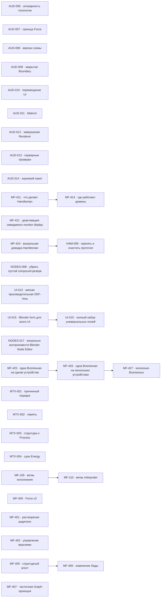

# MetaFor: граф исполнения

Здесь находятся только принятые задачи. Общие правила, состояния и жизненный
цикл заданы в [`README.md`](README.md), крупное направление — в
[`ROADMAP.md`](ROADMAP.md), а непринятая работа — в
[`BACKLOG.md`](BACKLOG.md).

Внутри одного приоритета порядок строк является порядком выбора. Стрелки на
графе показывают только настоящие зависимости, а не сходство тем.

## Граф зависимостей

## P1 — ближайшая работа

Текущая визуальная работа ведётся в `MF-424 — Визуально довести Hamiltonian
вместе с владельцем`. Подзадачи `MF-424.1` и `MF-424.3` приняты: серверная
часть остаётся в едином видимом контуре, а все одновременно открытые вкладки
находятся внутри одного Chrome и видят одинаковый retained lifecycle друг
друга. Текущий срез — `MF-424.2` про устойчивые цвета transport family и
легенду в панели `Вид холста`. Параллельно `MF-425 — Управлять одной Вселенной на
одном устройстве` уточняет границу устройства. Следом идут
`MF-426 — Распределить одну Вселенную между несколькими
устройствами` и `MF-427 — Управлять несколькими Вселенными`.
`MF-411 — Определить, что делает Hamiltonian и где он работает` остаётся
отдельной незавершённой работой. После неё начинается
`MF-414 — Определить, где работают домены и какая их копия действующая`.
`HAM-006 — Принять прототип Hamiltonian и очистить packages` ждёт завершения
живой visual acceptance `MF-424`; затем он завершит prototype line, удалит
prototype-only source/dependencies и примет clean-room contour.
`NODES-008 — Не оставлять пустой маршрутный резерв внутри compound` возвращена в работу:
checkpoint NODES-008.4 с общим исправлением левых интервалов сохранён отдельным
коммитом `b0fee1ee0`; owner review открыл NODES-008.5 для зеркального лишнего
интервала справа в `DOWN`. Реализация NODES-008.5 сохранена checkpoint-коммитом
`e1b2aea50` и ожидает визуального подтверждения владельца.

[`UI-010 — Сделать полный набор универсальных полей по Blender`](tasks/UI-010.md)
развивает production Components. NumberInput, ColorInput, VectorInput,
MatrixInput, ReferenceInput и EnumInput имеют package-owned stories и
package/live evidence. Текущий срез UI-010.7 добавляет public CollectionInput
для rows/selection/add/remove commit-ами `059deffc8` + `03b2c252b`; зависимая
UI-010.8 story/live `5df1327c5` завершила completeness `7/7`. Следующий public
leaf ещё не зарегистрирован. Текущий UI-010.9 добавляет owner-controlled
CollectionInput reorder commit-ом `2404e88ac`; зависимая UI-010.10 story/live
`7cae3d28c` завершена: encoded-PNG guard дал current non-black capture, exact
source/console и completeness `7/7`. Текущий UI-010.11 добавляет public
PathInput commit-ом `9aeb7f70c`; зависимая UI-010.12 story сейчас закрывает
completeness/live `8/8` source-ом `c998dd212` и current non-black capture. Новые
controls ждут UI-015 shape foundation, чтобы не продолжать старую pill form.

[`UI-015 — Перевести весь UI на форму и композицию Blender`](tasks/UI-015.md)
сохраняет palette/font MetaFor, но переводит Elements, Components, Fields и
Workbench на Blender 4.5.5 composition/form/rhythm. Текущий срез измеряет exact
reference и уже ввёл Elements shape owner `af5ae43a8`; UI-015.2 подключает его
к Input/Button primitive chrome commit-ом `e6f7669bf` с before/after evidence.
UI-015.3/.4 завершили dense scalar rows и настоящий Elements dropdown commits
`813f48994`, `ea1af7aa5`, `9365d9af0`: единый radius `4`, тихий idle border и
повторный material-only Button press. UI-015.6 commit `cd85f9614` удалил exact
Workbench overrides `999/12/34/36`; live before/after и Node regression зелёные.
Следующий UI-015.5 переводит Vector/Rotation/Matrix/Collection grouped editors.
Baseline на current Components Workbench подтвердил horizontal Vector,
раздельную Matrix и oversized Collection; UI-015.5 уже IN_PROGRESS.
Параллельный live audit Path/Reference/Color выявил текстовый `…`, missing
resource/picker actions и closed-only ColorInput; UI-015.7 доводит их до exact
catalog composition перед общей matrix.

[`UI-012 — Добавить мягкую производительную SDF-тень`](tasks/UI-012.md)
создала package-level Engine/Elements primitive commit-ом `e5d484ddc`: один
rounded SDF quad со spread/blur в local units, без texture pass. Node consumer
`b9f9419fb` и exact ordinary/selected live evidence `8ef8ed959` завершены;
задача в `REVIEW` перед independent closing.

[`NODES-017 — Визуально воспроизвести Blender Node Editor`](tasks/NODES-017.md)
возвращена в работу на integrated retained foundation. Следующий срез —
LOD owner GATE: старый `<0.38` skip уже удалён retained foundation, поэтому
нужно выбрать новый progressive threshold mechanism либо принять непрерывное
intrinsic scaling. Socket, geometric header и четырёхсторонняя selection shadow
уже имеют package/live evidence. Alignment, exact collapsed Mapping, physical
mobile и явная visual owner acceptance остаются следующими gates.

| ID     | Состояние   | Зависимости | Карточка                   |
| ------ | ----------- | ----------- | -------------------------- |
| MF-424 | IN_PROGRESS | нет         | [Открыть](tasks/MF-424.md) |
| HAM-006 | WAITING    | MF-424      | [Открыть](tasks/HAM-006.md) |
| MF-425 | IN_PROGRESS | нет         | [Открыть](tasks/MF-425.md) |
| MF-411 | IN_PROGRESS | нет         | [Открыть](tasks/MF-411.md) |
| NODES-008 | IN_PROGRESS | нет       | [Открыть](tasks/NODES-008.md) |
| UI-015 | IN_PROGRESS | нет         | [Открыть](tasks/UI-015.md) |
| UI-010 | WAITING     | UI-015      | [Открыть](tasks/UI-010.md) |
| UI-012 | REVIEW      | нет         | [Открыть](tasks/UI-012.md) |
| NODES-017 | IN_PROGRESS | нет      | [Открыть](tasks/NODES-017.md) |
| MF-414 | WAITING     | MF-411      | [Открыть](tasks/MF-414.md) |
| MF-426 | WAITING     | MF-425      | [Открыть](tasks/MF-426.md) |
| MF-427 | WAITING     | MF-426      | [Открыть](tasks/MF-427.md) |

## P2 — функциональное продолжение и надёжность

| ID      | Состояние   | Зависимости | Карточка                    |
| ------- | ----------- | ----------- | --------------------------- |
| MF-407  | READY       | нет         | [Открыть](tasks/MF-407.md)  |
| MF-421  | READY       | нет         | [Открыть](tasks/MF-421.md)  |
| AUD-009 | READY       | нет         | [Открыть](tasks/AUD-009.md) |
| AUD-005 | GATE        | нет         | [Открыть](tasks/AUD-005.md) |
| AUD-008 | GATE        | нет         | [Открыть](tasks/AUD-008.md) |
| AUD-013 | READY       | нет         | [Открыть](tasks/AUD-013.md) |
| AUD-010 | READY       | нет         | [Открыть](tasks/AUD-010.md) |
| AUD-011 | READY       | нет         | [Открыть](tasks/AUD-011.md) |
| AUD-012 | READY       | нет         | [Открыть](tasks/AUD-012.md) |
| MTX-001 | READY       | нет         | [Открыть](tasks/MTX-001.md) |
| AUD-007 | GATE        | нет         | [Открыть](tasks/AUD-007.md) |
| AUD-014 | GATE        | нет         | [Открыть](tasks/AUD-014.md) |

## P3 — поведение runtime

| ID      | Состояние | Зависимости | Карточка                    |
| ------- | --------- | ----------- | --------------------------- |
| MTX-002 | READY     | нет         | [Открыть](tasks/MTX-002.md) |
| MTX-003 | READY     | нет         | [Открыть](tasks/MTX-003.md) |

## P4 — отложенные решения

| ID      | Состояние | Зависимости | Карточка                    |
| ------- | --------- | ----------- | --------------------------- |
| MTX-004 | GATE      | нет         | [Открыть](tasks/MTX-004.md) |
| MF-400  | GATE      | нет         | [Открыть](tasks/MF-400.md)  |
| MF-401  | GATE      | нет         | [Открыть](tasks/MF-401.md)  |
| MF-402  | GATE      | нет         | [Открыть](tasks/MF-402.md)  |
| MF-109  | READY     | нет         | [Открыть](tasks/MF-109.md)  |
| MF-110  | WAITING   | MF-109      | [Открыть](tasks/MF-110.md)  |
| MF-405  | READY     | нет         | [Открыть](tasks/MF-405.md)  |
| MF-406  | WAITING   | MF-405      | [Открыть](tasks/MF-406.md)  |

## Требования к доказательству

Для завершения задачи нужны:

* изменённый закон и его постоянный владелец;
* точные публичные договоры;
* обычный пользовательский или предметный сценарий;
* выполненные команды проверки;
* фактический результат;
* известные ограничения;
* решение владельца, если задача проходила через `GATE`.
