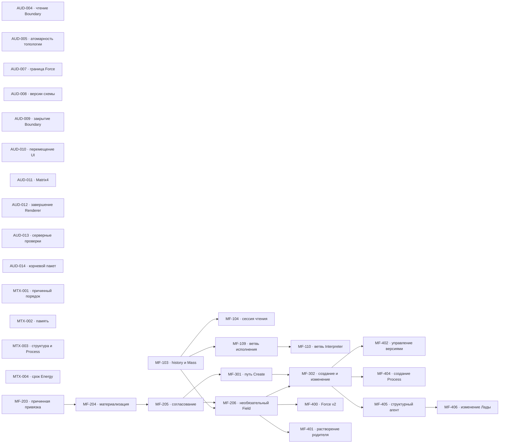

# MetaFor: граф исполнения

Здесь находятся только принятые задачи. Общие правила, состояния и жизненный
цикл заданы в [`README.md`](README.md), крупное направление — в
[`ROADMAP.md`](ROADMAP.md), а непринятая работа — в
[`BACKLOG.md`](BACKLOG.md).

Внутри одного приоритета порядок строк является порядком выбора. Стрелки на
графе показывают только настоящие зависимости, а не сходство тем.

## Граф зависимостей

## P0 — текущая надёжность

| ID      | Состояние | Зависимости | Карточка                    |
| ------- | --------- | ----------- | --------------------------- |
| AUD-004 | READY     | нет         | [Открыть](tasks/AUD-004.md) |
| AUD-009 | READY     | нет         | [Открыть](tasks/AUD-009.md) |
| AUD-005 | GATE      | нет         | [Открыть](tasks/AUD-005.md) |
| AUD-008 | GATE      | нет         | [Открыть](tasks/AUD-008.md) |
| AUD-013 | READY     | нет         | [Открыть](tasks/AUD-013.md) |
| AUD-010 | READY     | нет         | [Открыть](tasks/AUD-010.md) |
| AUD-011 | READY     | нет         | [Открыть](tasks/AUD-011.md) |
| AUD-012 | READY     | нет         | [Открыть](tasks/AUD-012.md) |
| MTX-001 | READY     | нет         | [Открыть](tasks/MTX-001.md) |
| AUD-007 | GATE      | нет         | [Открыть](tasks/AUD-007.md) |
| AUD-014 | GATE      | нет         | [Открыть](tasks/AUD-014.md) |

## P1 — наблюдение и доказательства

| ID       | Состояние   | Зависимости           | Карточка                     |
| -------- | ----------- | --------------------- | ---------------------------- |
| MF-103   | READY       | нет                   | [Открыть](tasks/MF-103.md)   |
| MF-104   | WAITING     | MF-103                | [Открыть](tasks/MF-104.md)   |
| MF-109   | WAITING     | MF-103                | [Открыть](tasks/MF-109.md)   |
| MF-110   | WAITING     | MF-109                | [Открыть](tasks/MF-110.md)   |
| MTX-002  | READY       | нет                   | [Открыть](tasks/MTX-002.md)  |
| MTX-003  | READY       | нет                   | [Открыть](tasks/MTX-003.md)  |

## P2 — структурное изменение

| ID     | Состояние   | Зависимости       | Карточка                   |
| ------ | ----------- | ----------------- | -------------------------- |
| MF-203 | REVIEW      | нет               | [Открыть](tasks/MF-203.md) |
| MF-204 | WAITING     | MF-203            | [Открыть](tasks/MF-204.md) |
| MF-205 | WAITING     | MF-204            | [Открыть](tasks/MF-205.md) |
| MF-206 | WAITING     | MF-205, MF-103    | [Открыть](tasks/MF-206.md) |

## P3 — Create MetaFor

| ID     | Состояние   | Зависимости    | Карточка                   |
| ------ | ----------- | -------------- | -------------------------- |
| MF-301 | WAITING     | MF-205         | [Открыть](tasks/MF-301.md) |
| MF-302 | WAITING     | MF-301, MF-206 | [Открыть](tasks/MF-302.md) |

## P4 — отложенные решения

| ID      | Состояние | Зависимости | Карточка                    |
| ------- | --------- | ----------- | --------------------------- |
| MTX-004 | GATE      | нет         | [Открыть](tasks/MTX-004.md) |
| MF-400  | GATE      | MF-206      | [Открыть](tasks/MF-400.md)  |
| MF-401  | GATE      | MF-206      | [Открыть](tasks/MF-401.md)  |
| MF-402  | GATE      | MF-302      | [Открыть](tasks/MF-402.md)  |
| MF-404  | WAITING   | MF-302      | [Открыть](tasks/MF-404.md)  |
| MF-405  | GATE      | MF-302      | [Открыть](tasks/MF-405.md)  |
| MF-406  | GATE      | MF-405      | [Открыть](tasks/MF-406.md)  |

## Требования к доказательству

Для завершения задачи нужны:

* изменённый закон и его постоянный владелец;
* точные публичные договоры;
* обычный пользовательский или предметный сценарий;
* выполненные команды проверки;
* фактический результат;
* известные ограничения;
* решение владельца, если задача проходила через `GATE`.
